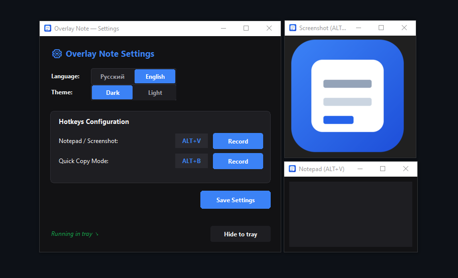

[Read in English](README.md) | [Читать на русском](README.ru.md)
# Overlay Note

**Overlay Note** is a compact and convenient Windows utility built with Python (Tkinter) that minimizes to the system tray, designed for quickly viewing clipboard content on top of all windows. 
The app automatically detects whether your clipboard contains text or an image and displays it in a floating window, while also providing a quick copy mode for notes.

  

## Key Features

* **Universal Overlay (`ALT+V`):**
  * If the clipboard contains an **image** (screenshot) — opens a compact floating window displaying the image on top of all windows.
  * If the clipboard contains **text** — opens a floating notepad with text editing and formatting support.
* **Quick Copy Mode (`ALT+B`):**
  * Opens a card with text from the clipboard. Clicking on the text instantly copies it back to the clipboard.
* **Text Drag-and-Drop:**
  * Ability to select and move text fragments using the mouse (holding LMB) inside the built-in notepad.
* **System Tray:**
  * Runs silently in the background and minimizes to the system tray.
* **Autosave & Localization:**
  * Support for **English** and **Russian** languages.
  * All settings (theme, language, hotkeys) are saved to `%APPDATA%\OverlayNote\config.json` and persist across restarts.

## Installation & Usage

### Executable (.exe)
1. Download the latest `overlay_app.exe` from the [Releases](https://github.com/Tumur4ekss/Overlay-Note/releases) section.
2. Run `overlay_app.exe` (no installation required).
3. The app will start minimized in your system tray.
